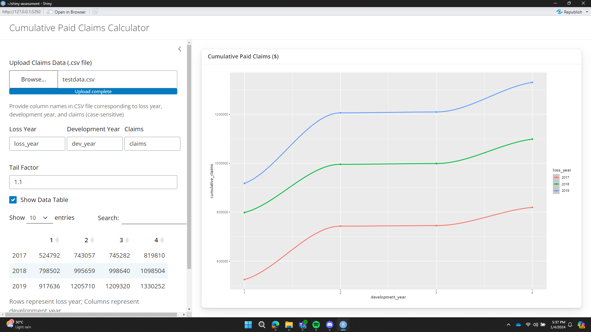

# shiny-assessment
### Description:
This repo contains my [R Shiny assessment](https://github.com/n-actuarial/r-shiny-intro) project, as part of my R Shiny training at n-actuarial. 

The shiny app takes input of claims data in the form of a .csv file and a numeric input tail factor.

From this data, it calculates the cumulative paid claims in each loss year and development year. This is displayed on a scatter plot and table.

### How to use: 
The app is currently hosted [here](https://alistair-fang.shinyapps.io/shiny-assessment). Alternatively, you may download the code and run it locally. 

Upload a .csv file containing the historical claims data for each loss and development year.

> [!IMPORTANT]
> The claims data **must** meet the following criteria:
> 1. Contain data of exactly N consecutive loss and development years, where N is a positive integer
> 2. Development years start from 1
> 3. For the jth development year, we have claims data for the first N - j + 1 loss years 

*[testdata.csv](testdata.csv)* is included in the repo as an example input file (extracted from orginal specification excel sheet).  

In the input boxes, input the names of the columns in your .csv file that correspond with loss year, development year, claims respsectively.

Then, input a tail factor (default 1.1). The plot and table will automatically be displayed. 
Below is a screenshot of the output produced with *testdata.csv* and tail factor 1.1.

Unchecking the 'Show Data Table' box will hide the data table. 

### Testing: 
The app emulated the output of the specification excel sheet correctly throughout my testing, where I altered the claims' numbers and/or tail factor.

While in theory the app should also work for larger datasets (N > 3) meeting the criteria above, I am unable to test this as I lack knowledge/understanding of the expected output in these cases. 

### Design: 
The code was designed under the assumption that criteria above are met. These criteria are chosen because:
1. For the sake of simplicity 
2. Lack of understanding on how the calculations would be run otherwise

I have contemplated adding a validation function to check if the input file meets the given criteria, but did not deem it worth the effort/time.  

 

